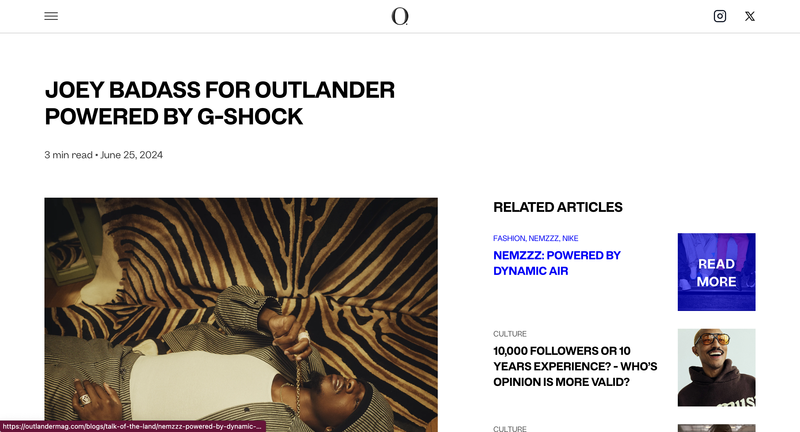
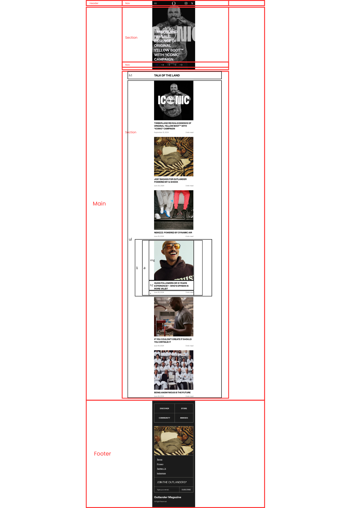
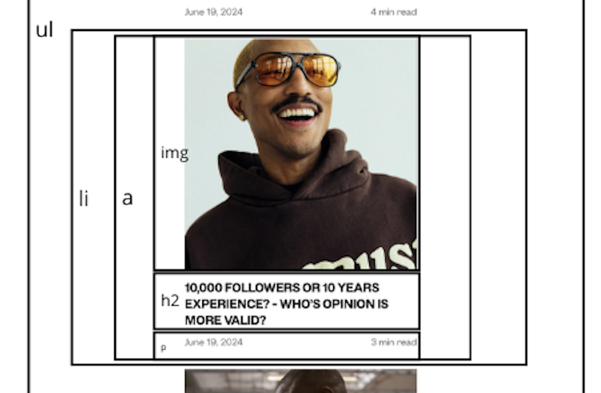
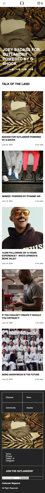
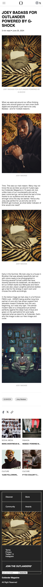

# Procesverslag
Markdown is een simpele manier om HTML te schrijven.  
Markdown cheat cheet: [Hulp bij het schrijven van Markdown](https://github.com/adam-p/markdown-here/wiki/Markdown-Cheatsheet).

Nb. De standaardstructuur en de spartaanse opmaak van de README.md zijn helemaal prima. Het gaat om de inhoud van je procesverslag. Besteedt de tijd voor pracht en praal aan je website.

Nb. Door *open* toe te voegen aan een *details* element kun je deze standaard open zetten. Fijn om dat steeds voor de relevante stuk(ken) te doen.

## Jij

  
uitwerken voor kick-off werkgroep

  ### Auteur:
  Sidate Seck

  #### Je startniveau:
  Blauw

  #### Je focus:
  Surface
 

## Je website

  
uitwerken voor kick-off werkgroep

  ### Je opdracht:
  link naar de website die je gaat namaken óf de naam/omschrijving van je eigen ontwerp

 https://outlandermag.com/

  #### Screenshot(s) van de eerste pagina (small screen): 
  homepage
  

  #### Screenshot(s) van de tweede pagina (small screen):
 Artikelpagina
  
 

## Toegankelijkheidstest 1/2 (week 1)

  
uitwerken na test in 2e werkgroep

  ### Bevindingen
  Lijst met je bevindingen die in de test naar voren kwamen:

  - Heel veel/snel informatie achter elkaar
  - Geen omschrijvende h1
  - Geen duidelijk alt-teksten
  - Sommige links worden geskipt
  - De screenreader begon bij de navigatie
  - Afbeeldingen hadden een niet heel gedetailleerde/ duidelijk alt
  - De volgorde is grotendeel wel logisch
  - De VoiceOver spreekt vaak zonder interpunctie
  - Onzichtbare links worden voorgelezen

## Breakdownschets (week 1)

  
uitwerken na afloop 3e werkgroep

  ### de hele pagina: 
  

  ### dynamisch deel (bijv menu): 
  

  ### wellicht nog een dynamisch deel (bijv filter): 
  

## Voortgang 1 (week 2)

  
uitwerken voor 1e voortgang

  ### Stand van zaken
  Voor mijn gevoel kom ik echt niet ver en ik heb best wel moeite met de opdrachten van Sanne

  Goed: Ik heb geprobeerd de opdrachten van Sanne te maken

  ### Agenda voor meeting
  samen met je groepje opstellen

  | student 1      | student 2          | student 3    | student 4        |
  | ---            | ---                | ---          | ---              |
  | dit bespreken  | en dit             | en ik dit    | en dan ik dat    |
  | en dat ook nog | dit als er tijd is | nog een punt | dit wil ik zeker |
  | ...            | ...                | ...          | ...              |

  ### Verslag van meeting
  hier na afloop snel de uitkomsten van de meeting vastleggen

  - Carrousel-opdracht van Sanne vragen aan studentassistenten
  - Meer vragen om hulp
  - Github updaten
  - Hulp gekregen met GitHub extensie downloaden

## Voortgang 2 (week 3)

  
uitwerken voor 2e voortgang

  ### Stand van zaken
  Ik loop een beetje vast en weet niet echt hoe ik verder moet. De breakdownschets die ik heb gemaakt heeft mij wel meer overzicht gegeven maar naast mijn <main> heb ik erg moeite.

  ### Agenda voor meeting
  samen met je groepje opstellen

  | student 1      | student 2          | student 3    | student 4        |
  | ---            | ---                | ---          | ---              |
  | dit bespreken  | en dit             | en ik dit    | en dan ik dat    |
  | en dat ook nog | dit als er tijd is | nog een punt | dit wil ik zeker |
  | ...            | ...                | ...          | ...              |

  ### Verslag van meeting
  hier na afloop snel de uitkomsten van de meeting vastleggen

  - Eigenlijk best wel positieve feedback gekregen van Ivo
  - Readme bijwerken
  - Site hoeft niet identiek te zijn. Het gaan meer om correcte code
  - Duidelijkheid gekregen over wat in een section kan
  - Kijk naar alternatieven als Grid niet lukt
  - Geholpen met de main een beetje naar beneden krijgen
  - Gebruik comments om bronnen te vermelden

## Toegankelijkheidstest 2/2 (week 4)

  
uitwerken na test in 9e werkgroep

  ### Bevindingen

- Ik zag dat nog niet al mijn images een (duidelijke) alt-tag hadden, deze heb ik aangepast.
- Veel van mijn elementen waren nog niet selecteerbaar met de tab-toets, ik heb aangepast door deze elementen en tabindex= "0"; te geven.
- Ik ga de pijltjes een aria-label gegeven.
- buttons ga ik ook een aria-label gegeven.
- Ik ga het mogelijk maken om de lettergrootte aan te passen.
- Ik ga een keyboard shortcut toevoegen om naar het einde van de pagina te gaan.
- Ik ga de exposure van de images in de carrousel lager maken zodat de witte tekst en de pijltjes beter leesbaar zijn.
- Ik geef een filter aan de images en svg's zodat de zichtbaar blijven als het theme wordt aangepast.

## Voortgang 3 (week 4)

  
uitwerken voor 3e voortgang

  ### Stand van zaken
  Gaat de goede kant op, ik moet wel nog hulp krijgen bij mijn navigation & hamburgermenu, daarnaast moet ik nog de toegankelijkheidstest uitvoerem.

  ### Agenda voor meeting
  samen met je groepje opstellen

  | student 1      | student 2          | student 3    | student 4        |
  | ---            | ---                | ---          | ---              |
  | dit bespreken  | en dit             | en ik dit    | en dan ik dat    |
  | en dat ook nog | dit als er tijd is | nog een punt | dit wil ik zeker |
  | ...            | ...                | ...          | ...              |

  ### Verslag van meeting
  hier na afloop snel de uitkomsten van de meeting vastleggen

  - Hulp gekregen van David bij navigatie & hamburgermenu
  - Aan de slag met 2e pagina
  - Letten op toegankelijkheid
  - ...

## Eindgesprek (week 5)

  
uitwerken voor eindgesprek

  ### Je uitkomst - karakteristiek screenshots:
  
  

  ### Dit ging goed/Heb ik geleerd: 
  Aan het begin van dit vak had ik eerlijk gezegd geen idee wat ik aan het doen was. De opdrachten van Sanne hielpen me om dingen te begrijpen maar ik vond het nog steedds heel lastig om dit toe te passen op mijn eigen website. Ik heb deze afgelopen periode denk ik echt ingezien hoe belangrijk het is om dingen te vragen. Niet alleen helpt dit mij om verder te komen, maar ik kreeg steeds meer het gevoel dat ik dingen echt begreep en ben ook buiten de opdrachten van Sanne om dingen gaan onderzoeken en experimenteren.

  Ik dacht dat ik het nooit zou zeggen, maar na dit resultaat (ook al weet ik nog niet of het voldoende is) ben ik toch heel trots op mezelf. Ik zat naar mijn gevoel zelfs nog een niveau onder de blauwe piste, maar heb na dit vak denk ik echt vooruitgang geboekt. Ook op het gebied van toegankelijkheid heb ik veel geleerd. Onder andere het symposium heeft mij in laten zien hoe belangrijk het is om hier op te letten. Ik hoop dat ik hier voldoende van heb laten zien in mijn code!

  

  ### Dit was lastig/Is niet gelukt:
  De navigatie in de originele site is eerst doorzichtig, en als je naar beneden scrollt wit. Ik weet kwam hier écht niet uit dus ik heb mij eerst gefocust op de andere onderdelen van mijn website.

  

## Bronnenlijst

  
continu bijhouden terwijl je werkt

  Nb. Wees specifiek ('css-tricks' als bron is bijv. niet specifiek genoeg). 
  Nb. ChatGpT en andere AI horen er ook bij.
  Nb. Vermeld de bronnen ook in je code.

  1. https://cssgrid-generator.netlify.app/ - Voor grid in de footer
  2.https://outlandermag.com/ - Referentiesite & voor afbeeldingen en svg's
  3. https://chatgpt.com/share/66fc080c-78ac-8005-b6c3-e413d8d3fd6d - Om mijn css op te schonen, vragen waarom js niet werkte en keyboard shortcut
  4. https://chatgpt.com/share/66fc0996-e648-8005-9356-0395fa455ebb - Dit gesprek heb ik gebruikt om mij op weg te helpen met bepaalde dingen zoals de header, hoe ik filters om images zet, hulp met flexbox en hoe ik tekst krijg op mijn caroussel. Daarbij moet ik wel zeggen dat ik vrijwel niets van deze dingen uiteindelijk heb gebruikt omdat ik het veel beter begreep als ik het bijvoorbeeld vroeg aan een studentassistent.

